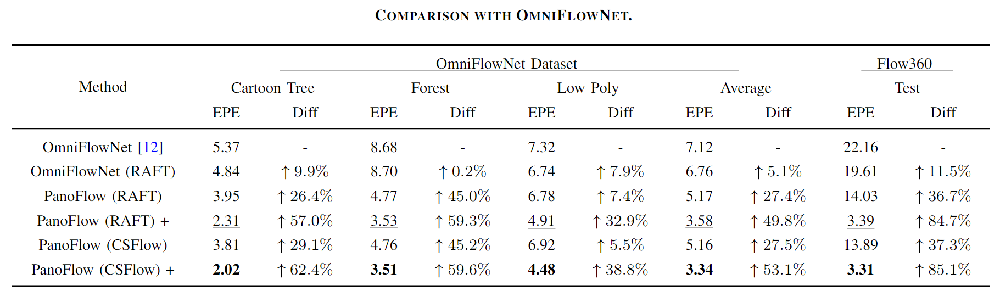

# PanoFlow: Learning Optical Flow for Panoramic Images
The implementations of [PanoFlow: Learning Optical Flow for Panoramic Images](https://arxiv.org/pdf/2202.13388.pdf). 
We achieve state-of-the-art accuracy on the public OmniFlowNet dataset and the proposed Flow360 dataset.
This repository is built on the basis of [CSFlow](https://github.com/MasterHow/CSFlow).




# Flow360 Dataset

From left to right: overlapping image pairs, optical flow, and semantics. 
Flow360 dataset consists of 8 various city maps in four weathers: 
sunny, fog, cloud, and rain. 
We collect 100 consecutive panoramic images at each random position, 
resulting in a total of 6,400 frames with a resolution of 1024 x 512 , 
each with optical flow ground truth and semantic labels, 
which can be used for training and evaluation. In the current release, 
we provide optical flow ground truth in the classic format (i.e. the traditional flow).
If you need 360° flow ground truth, you can simply convert it refer to the 
[paper](https://arxiv.org/pdf/2202.13388.pdf).

Since the flow field of panoramic images usually contains large displacement that interferes with visualization and fades colors, 
we modified the visualization method of optical flow, 
and lowered the color saturation of optical flow greater than the threshold.

```
better_flow_to_image(flow, alpha=0.1, max_flow=25)
```
The function can be found in the flow_utils.py. In our paper, we set the alpha=0.1, max_flow=25.

The valid mask excludes pixels whose semantics are sky.

The semantic labels are as following:
```
camvid_colors = OrderedDict([
    ("Unlabeled", np.array([0, 0, 0], dtype=np.uint8)),
    ("Building", np.array([70, 70, 70], dtype=np.uint8)),
    ("Fence", np.array([100, 40, 40], dtype=np.uint8)),
    ("Other", np.array([55, 90, 80], dtype=np.uint8)),
    ("Pedestrian", np.array([220, 20, 60], dtype=np.uint8)),
    ("Pole", np.array([153, 153, 153], dtype=np.uint8)),
    ("RoadLine", np.array([157, 234, 50], dtype=np.uint8)),
    ("Road", np.array([128, 64, 128], dtype=np.uint8)),
    ("SideWalk", np.array([244, 35, 232], dtype=np.uint8)),
    ("Vegetation", np.array([107, 142, 35], dtype=np.uint8)),
    ("Vehicles", np.array([0, 0, 142], dtype=np.uint8)),
    ("Wall", np.array([102, 102, 156], dtype=np.uint8)),
    ("TrafficSign", np.array([220, 220, 0], dtype=np.uint8)),
    ("Sky", np.array([70, 130, 180], dtype=np.uint8)),
    ("Ground", np.array([81, 0, 81], dtype=np.uint8)),
    ("Bridge", np.array([150, 100, 100], dtype=np.uint8)),
    ("RailTrack", np.array([230, 150, 140], dtype=np.uint8)),
    ("GroundRail", np.array([180, 165, 180], dtype=np.uint8)),
    ("TrafficLight", np.array([250, 170, 30], dtype=np.uint8)),
    ("Static", np.array([110, 190, 160], dtype=np.uint8)),
    ("Dynamic", np.array([170, 120, 50], dtype=np.uint8)),
    ("Water", np.array([45, 60, 150], dtype=np.uint8)),
    ("Terrain", np.array([145, 170, 100], dtype=np.uint8)),
])
```

Anyone can download our Flow360 dataset via this link.

```
https://share.weiyun.com/SoXICYgh
```

# Install
```
python setup.py develop
```

# Pretrained Model
The pretrained model that the paper used can be found there:
```
https://share.weiyun.com/MVj65ZRD
```
Notice that the checkpoints don‘t consist of the CFE, 
considering that CFE is an estimation method, 
you only need to turn it on while inferring to obtain the 360° flow.

# Train and Eval
To train, use the following command format:
```
python ./tools/train.py
--model PanoFlow(CSFlow)
--dataset Flow360
--data_root $YOUR_DATA_PATH$
--batch_size 6
--name PanoFlow(CSFlow)-test
--validation Chairs
--val_Chairs_root $YOUR_DATA_PATH$
--num_steps 100
--lr 0.000125
--image_size 400 720
--wdecay 0.0001
```
To eval, use the following command format:
```
python ./tools/eval.py
--model CSFlow
--restore_ckpt ./checkpoints/CSFlow-C+T+F.pth
--validation Flow360
--val_Flow360_root $YOUR_DATA_PATH$
```
For more details, please check the code or refer our [paper](https://arxiv.org/pdf/2202.13388.pdf).

# Folder Hierarchy
\* local: you should create this folder in your local repository and these folders will not upload to remote repository.
```
├── data (local)            # Store test/training data
├── checkpoints (local)     # Store the checkpoints
├── runs (local)            # Store the training log
├── opticalflow             # All source code
|   ├─ api                  # Called by tools
|   ├─ core                 # Core code call by other directorys. Provide dataset, models ....
|   |   ├─ dataset          # I/O of each dataset
|   |   ├─ model            # Models, includeing all the modules that derive nn.module
|   |   ├─ util             # Utility functions
├── tools                   # Scripts for test and train
├── work_dirs (local)       # For developers to save thier own codes and assets
```

# Devs
Hao Shi，YiFan Zhou

# Need Help?
If you have any questions, welcome to e-mail me: haoshi@zju.edu.cn, and I will try my best to help you. =)