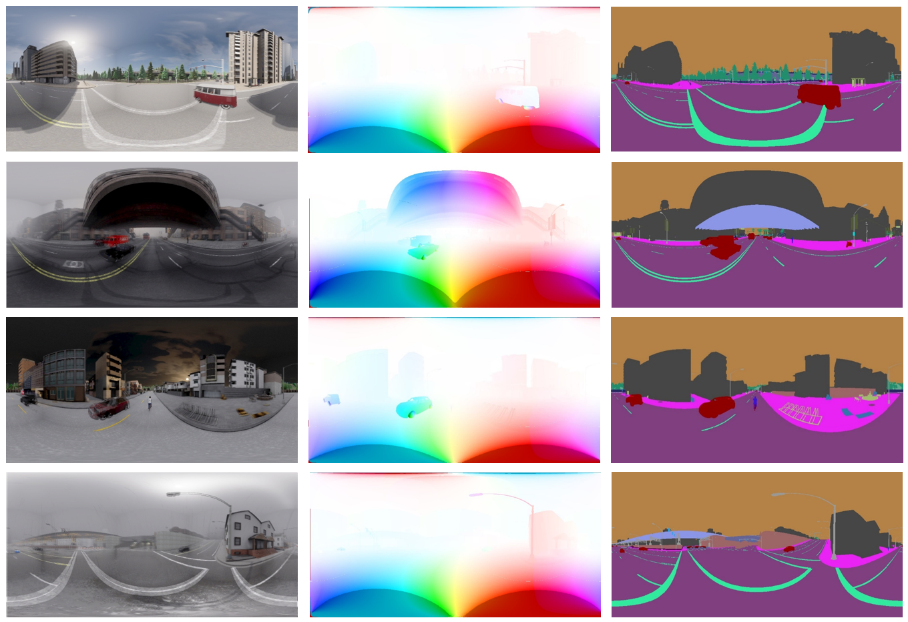

# PanoFlow
The implementaions of [PanoFlow: Learning Optical Flow for Panoramic Images](https://arxiv.org/pdf/2202.13388.pdf). 
We achieve state-of-the-art accuracy on the public OmniFlowNet dataset and the proposed Flow360 dataset.
This repository is built on the basis of [CSFlow](https://github.com/MasterHow/CSFlow).


# Flow360 Datset

From left to right: overlapping image pairs, optical flow, and semantics. 
Flow360 dataset consists of 8 various city maps in four weathers: 
sunny, fog, cloud, and rain. 
We collect 100 consecutive panoramic images at each random position, 
resulting in a total of 6,400 frames with a resolution of 1024 x 512 , 
each with optical flow ground truth and semantic labels, 
which can be used for training and evaluation. 
Since the flow field of panoramic images usually contains large displacement that interferes with visualization and fades colors, 
we modified the visualization method of optical flow, 
and lowered the color saturation of optical flow greater than the threshold.

```
better_flow_to_image(flow, alpha=0.1, max_flow=25)
```
The function can be found in the flow_utils.py. In our paper, we set the alpha=0.1, max_flow=25.
Any one can download our Flow360 dataset via this link.

```
https://share.weiyun.com/SoXICYgh
```

# Install
```
python setup.py develop
```

# Devs
Hao Shi，YiFan Zhou

# Folder Hierarchy
\* local: you should create this folder in your local repository and these folders will not upload to remote repository.
```
├── data (local)            # Store test/training data
├── opticalflow             # All source code
|   ├─ api                  # Called by tools
|   ├─ core                 # Core code call by other directorys. Provide dataset, models ....
|   |   ├─ dataset          # I/O of each dataset
|   |   ├─ model            # Models, includeing all the modules that derive nn.module
|   |   ├─ util             # Utility functions
├── tools                   # Scripts for test and train
├── work_dirs (local)       # For developers to save thier own codes and assets
```

# The Code is coming soon.